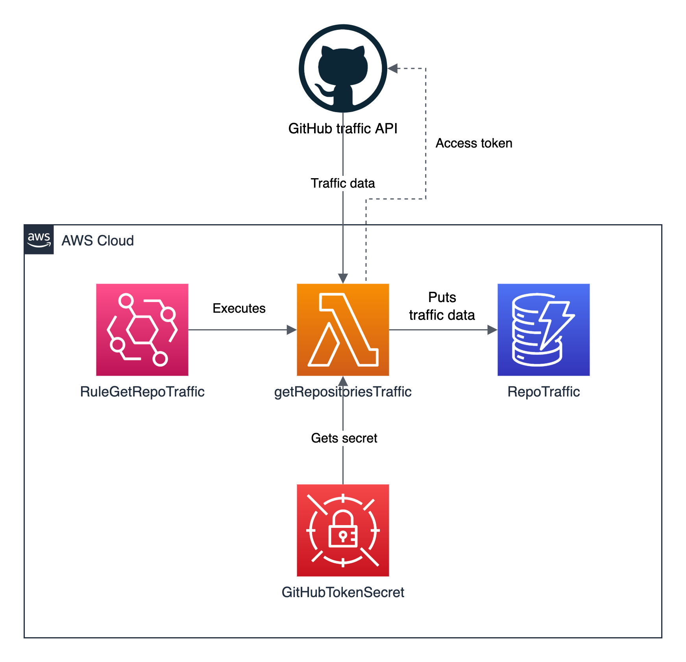

# github-traffic-capture
This repository contains a CDK project that deploys an AWS infrastructure capable of retrieving and storing historic traffic data about the GitHub repositories to which you have push access to.

## In this page
- [About the traffic API](#about-the-traffic-api)
- [Architecture and considerations](#architecture-and-considerations)
- [Deployment instructions](#deployment-instructions)
- [Cleaning up](#cleaning-up)

## About the traffic API

The [GitHub repository traffic API](https://docs.github.com/en/rest/metrics/traffic) provides access to the following information:
- Repository clones
- Top referral paths
- Top referral sources
- Page views

This CDK project collects repository clones and page views on a daily basis, to allow for historic data representation and gather trend insights about your content. 

## Architecture and considerations

The following diagram shows the architecture that will be deployed. Considerations are discussed below it:



### Considerations

- To track the traffic of your repositories, modify the contents of the `REPOS` array defined in the Lambda function `getRepositoriesTraffic`. You must have push access to the repositories you want to track. If you get an API rate access error, take a look at [the GitHub REST API documentation](https://docs.github.com/en/rest/overview/resources-in-the-rest-api#rate-limiting)
- The EventBridge rule `RuleGetRepoTraffic` is triggered every day at 9 AM and retrieve **views** and **clones** traffic for the repositories that you specify
- Repo traffic data is stored in the `RepoTraffic` DynamoDB table. This table has a partition key `repo-name` and a sort key `timestamp`
- Your GitHub access token is securely stored as a Secrets Manager Secret, and you provide it as a parameter when deploying the stack

## Deployment instructions

The following steps assume that you have Python and [venv](https://docs.python.org/3/library/venv.html) installed in your local machine.

### 1. Cloning the repository

Navigate to the directory in your machine where you want the repository to be cloned and execute the following command:

```bash
git clone https://github.com/bpguasch/github-traffic-capture.git
```

### 2. Creating a virtual environment and installing project dependencies

After cloning this repository, navigate to the `cdk-app` directory, and execute the following commands:

#### 2.1 Creating the virtual environment

```python
python3 -m venv .venv
```

#### 2.2 Installing project dependencies in the virtual environment

```python
source .venv/bin/activate
python -m pip install -r requirements.txt
```

### 3. Bootstrapping your AWS account

Deploying AWS CDK apps into an AWS environment may require that you provision resources the AWS CDK needs to perform the deployment. These resources include an Amazon S3 bucket for storing files and IAM roles that grant permissions needed to perform deployments. Execute the following command to bootstrap your environment:

```bash
cdk bootstrap
```

You can read more about this process [here](https://docs.aws.amazon.com/cdk/v2/guide/bootstrapping.html).

### 4. Deploying using CDK

You must specify a value for the **GitHubAccessToken** parameter when you deploy the stack. To do so, execute the following command:

```bash
cdk deploy --parameters GitHubAccessToken=<str value>
```

The deployment process will take roughly **3 minutes** to complete.

## Cleaning up

To delete all the resources created by CDK:

1. Navigate to the **CloudFormation** section in the AWS console.
2. Select the stack named **GitHubTrafficCaptureStack** and click on **Delete**.

Alternatively, you can execute the following command:

```bash
cdk destroy
```